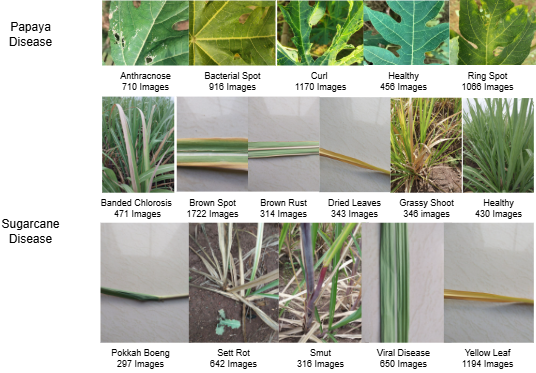

# PSMCMD & EBITRNet-B0: Multi-Crop Disease Recognition

[](https://opensource.org/licenses/MIT)
[](https://www.python.org/downloads/)

Official implementation of **EBITRNet-B0** and the **Papaya–Sugarcane Multi-Crop Multi-Disease (PSMCMD)** dataset. This project leverages a hybrid deep learning architecture to classify 16 distinct classes (diseases + healthy) across two major crops.

---

## 📊 Dataset: PSMCMD



The **PSMCMD** dataset comprises high-resolution leaf images exhibiting diverse bacterial, viral, and fungal symptoms. It provides a challenging benchmark by simulating real-field variability.
Dataset Link: https://data.mendeley.com/datasets/5555cvmmgb/6
### Class Distribution
| Crop | Condition | Count | Crop | Condition | Count |
| :--- | :--- | :--- | :--- | :--- | :--- |
| **Sugarcane** | Banded Chlorosis | 471 | **Papaya** | Anthracnose | 710 |
| | Brown Spot | 1722 | | Bacterial Spot | 916 |
| | Brown Rust | 314 | | Curl | 1170 |
| | Dried Leaves | 343 | | Healthy | 456 |
| | Grassy Shoot | 346 | | Ring Spot | 1066 |
| | Healthy | 430 | | | |
| | Pokkah Boeng | 297 | | | |
| | Sett Rot | 642 | | | |
| | Viral Disease | 316 | | | |
| | Yellow Leaf | 650 | | | |
| | Smut | 1194 | | | |

### Data Augmentation Pipeline
To ensure model robustness, we apply extensive transformations:
* **Geometric:** Random Flipping ($\pm90^\circ$), Scaling ($0.8$–$1.2\times$), Rotation ($\pm25^\circ$), and Zoom ($20\%$).
* **Photometric:** Brightness ($\pm20\%$), Contrast ($\pm15\%$), and Color Saturation adjustments.

---

## 🧠 Model Architecture: EBITRNet-B0
**EBITRNet-B0** is a state-of-the-art framework that integrates:
1.  **EfficientNet-B0:** For fine-grained lesion textural details.
2.  **BiT-ResNetv2:** For high-level semantic feature extraction.
3.  **Channel-wise Attention:** To prioritize disease-relevant features and suppress complex backgrounds.

> **Key Result:** EBITRNet-B0 outperforms conventional CNNs in accuracy, precision, and $F_1$-score on the PSMCMD benchmark.

---
## Related Paper
"Attention-Enhanced Hybrid CNN Architecture for Multi-Crop and Multi-Disease Classification: A Case Study on Papaya and Sugarcane" at Presented CVIP 2025 Conference IIT Ropar by Dr. Neeta Nain (Professor) Department of CSE MNIT Jaipur (India) 302017

### Paper Citation
Anand Kumar Jain and Neeta Nain, "Attention-Enhanced Hybrid CNN Architecture for Multi-Crop and Multi-Disease Classification: A Case Study on Papaya and Sugarcane" , 10th IAPR-Endorsed International Conference on Computer Vision and Image Processing CVIP 2025 by :Springer at IIT Ropar / 20 - 31 / 2025 ISBN: Paper ID: 682

## 🚀 Installation & Usage

### 1. Clone the repository
```bash
git clone [https://github.com/your-username/PSMCMD-EBITRNet.git](https://github.com/your-username/PSMCMD-EBITRNet.git)
cd PSMCMD-EBITRNet

